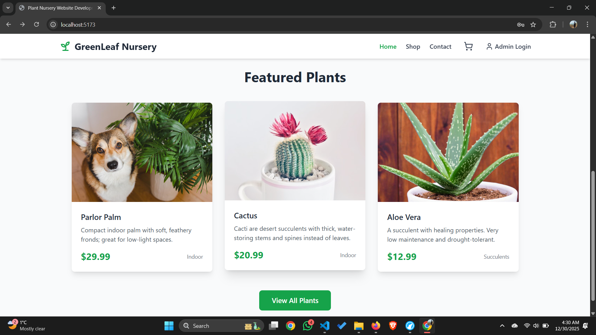
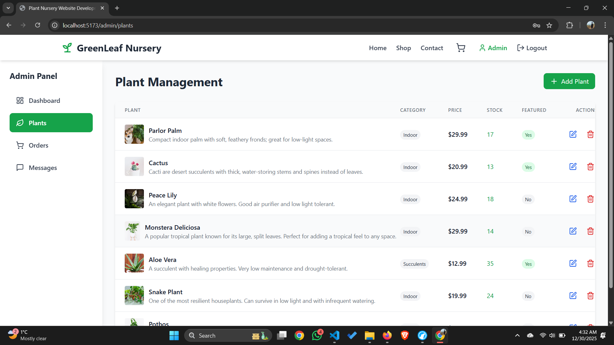
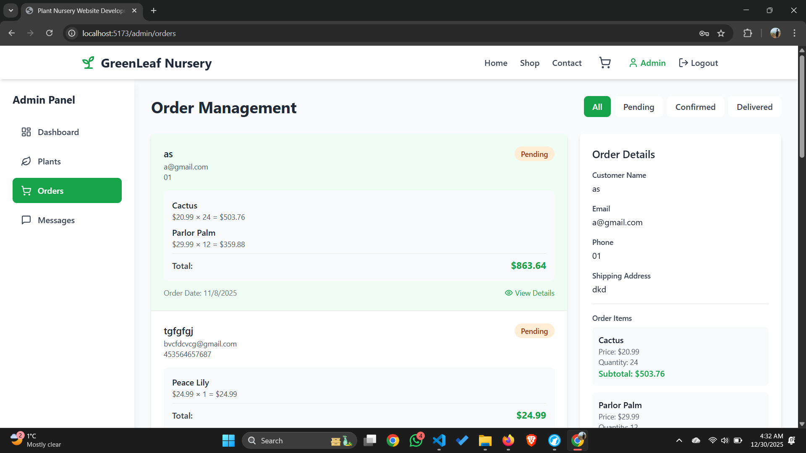

# 🌿 GreenLeaf Nursery

A modern, full-stack e-commerce platform for plant lovers. Built with React, TypeScript, Express.js, PostgreSQL, and Supabase.


## 📸 Screenshots

### Landing Page



### Shop Page


### Plant Details


### Admin Dashboard


### Plant Management



## 📋 Table of Contents

- [Features](#features)
- [Tech Stack](#tech-stack)
- [Prerequisites](#prerequisites)
- [Installation](#installation)
- [Configuration](#configuration)
- [Running the Application](#running-the-application)
- [Support](#support)
- [License](#license)

## ✨ Features

### For Customers
- 🛒 Browse and search plant catalog
- 🔍 Detailed plant information and care instructions
- 🛍️ Shopping cart functionality
- ✅ Order placement with confirmation
- 🔐 User authentication
- 📱 Responsive design for mobile and desktop

### For Administrators
- 📊 Admin dashboard with analytics
- 🌱 Plant inventory management (Add, Edit, Delete)
- 📦 Order management and tracking
- 💬 Customer message management

## 🛠️ Tech Stack

**Frontend:**
- React 18+
- TypeScript
- Vite
- Tailwind CSS
- React Router DOM
- Lucide React (Icons)

**Backend:**
- Node.js
- Express.js
- PostgreSQL
- Supabase (Authentication & Database)

**Additional Tools:**
- ESLint
- PostCSS

## 📦 Prerequisites

Before you begin, ensure you have the following installed:

- **Node.js** (v18 or higher) - [Download](https://nodejs.org/)
- **npm** (comes with Node.js) or **yarn**
- **Git** - [Download](https://git-scm.com/)
- **Supabase Account** - [Sign up](https://supabase.com/)

## 🚀 Installation

### 1. Clone the Repository

```bash
git clone https://github.com/sigma-asif/GreenLeaf-Nursery.git
cd GreenLeaf-Nursery
```

### 2. Install Dependencies

```bash
npm install
```

or if you use yarn:

```bash
yarn install
```

## ⚙️ Configuration

### 1. Create Environment File

Create a `.env` file in the root directory:

```bash
touch .env
```

### 2. Add Environment Variables

Open `.env` and add your Supabase credentials:

```env
VITE_SUPABASE_URL=your_supabase_project_url
VITE_SUPABASE_ANON_KEY=your_supabase_anon_key
```

**How to get Supabase credentials:**
1. Go to [Supabase Dashboard](https://app.supabase.com/)
2. Select your project
3. Go to Settings → API
4. Copy your **Project URL** and **anon/public key**

### 3. Database Setup

**Option A: Use Supabase Dashboard**
1. Go to your Supabase project
2. Navigate to the SQL Editor
3. Run the necessary table creation scripts (if provided)

**Option B: Use Migration Files**
If you have migration files in your project:
```bash
# Run migrations (if applicable)
npm run migrate
```

## 🏃 Running the Application

### Development Mode

Start the development server:

```bash
npm run dev
```

The application will open at `http://localhost:5173` (or another port shown in terminal)

### Production Build

Build the application for production:

```bash
npm run build
```

Preview the production build:

```bash
npm run preview
```

## 📧 Support

For issues or questions:
- Open an issue on GitHub
- Contact: realrahmanasif@gmail.com

## 📄 License

This project is licensed under the MIT License - see the LICENSE file for details.

## 👨‍💻 Author

**Asif**
- GitHub: [@sigma-asif](https://github.com/sigma-asif)

---

Made with 💚 by the GreenLeaf Nursery Team
